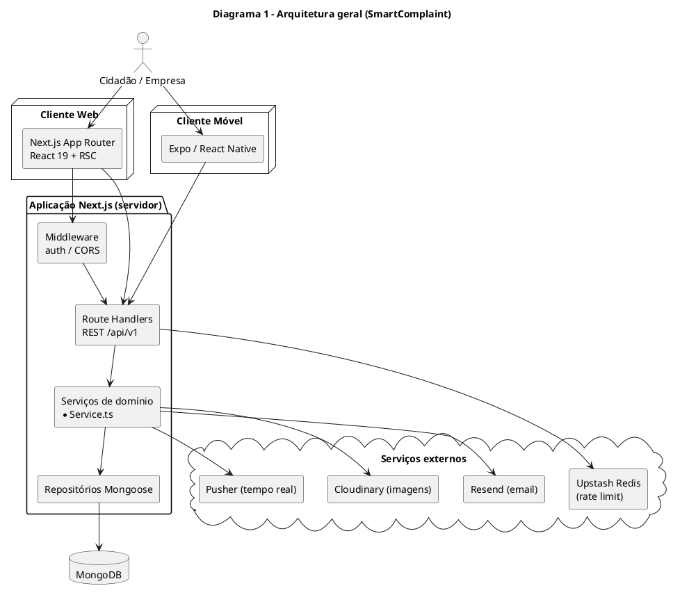
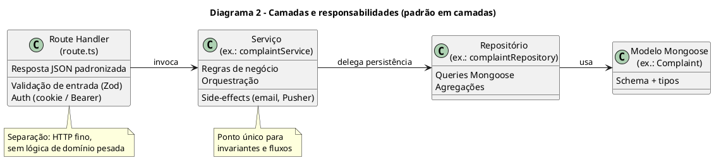
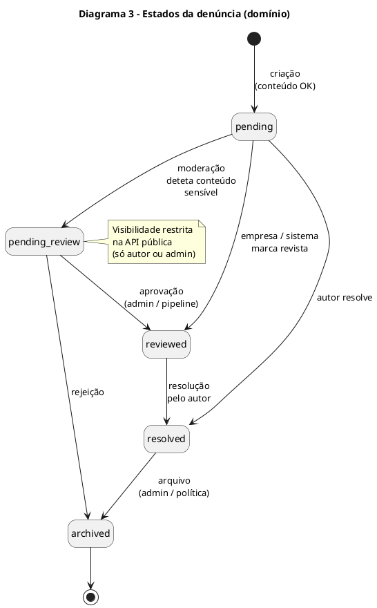
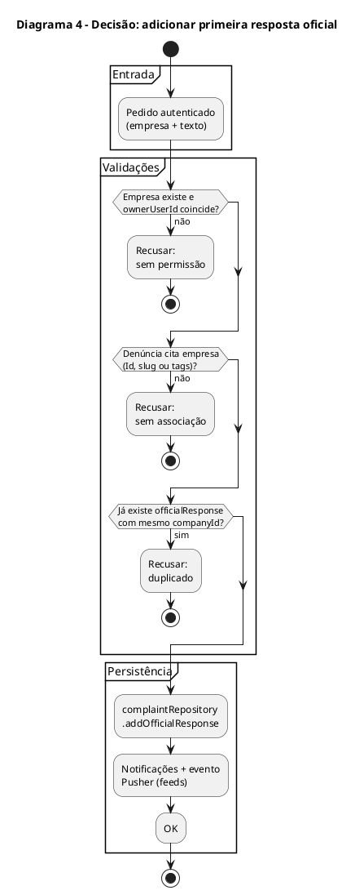
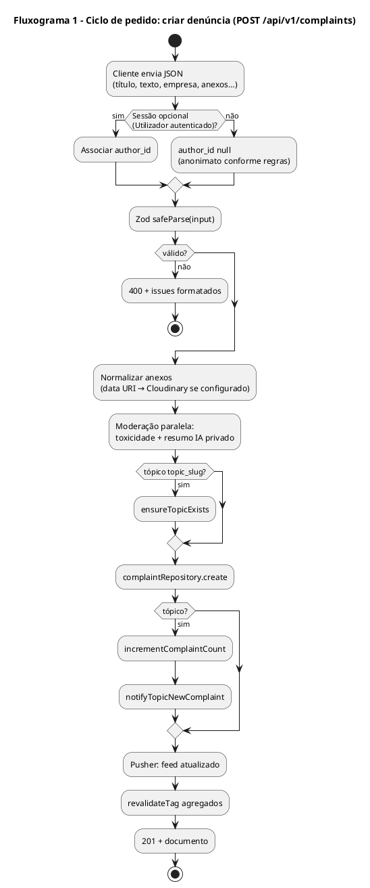
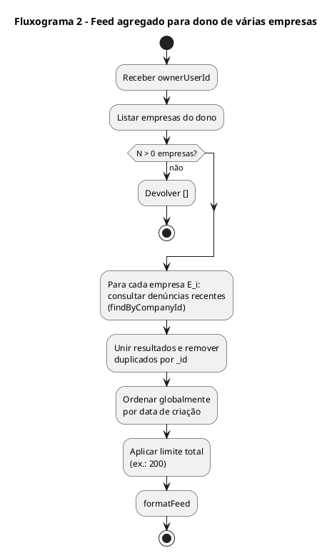
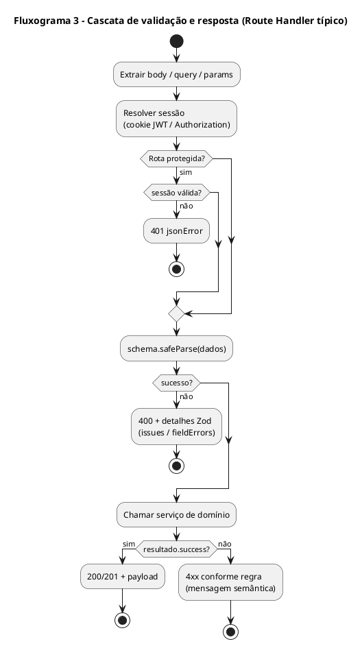

# Relatório Técnico

**Projeto** – SmartComplaint (plataforma web, API REST e cliente móvel)

**Curso / contexto académico** – *(ajuste conforme o seu currículo oficial; o modelo original referia o CET em Tecnologias e Programação de Sistemas de Informação.)*

**Unidade curricular** – *(ajuste, ex.: desenvolvimento de aplicações para a Web)*

**Formando** – Hernâni Arriscado

**Formador** – *(nome, se aplicável)*

**Data** – maio de 2026

**Versão PDF (A4, texto justificado):** na raiz do repositório executar `npm run report:tecnico-pdf` — gera `docs/Relatorio-Tecnico-SmartComplaint.pdf` a partir deste ficheiro, com estilo definido em `docs/report-tecnico-pdf.css`.

---

## Índice

1. [Introdução e Objetivos](#1-introdução-e-objetivos)
   - 1.1. Contextualização do Projeto  
   - 1.2. Estrutura do Relatório  
   - 1.3. Objetivos do Projeto  

2. [Parte I: Fundamentação e Desenho Arquitetural](#2-parte-i-fundamentação-e-desenho-arquitetural)
   - 2.1. Arquitetura Cliente–Servidor e Separação de Preocupações  
   - 2.2. Máquinas de Estados e Ciclo de Vida da Denúncia  
   - 2.3. Padrões de Projeto Aplicados  
   - 2.4. Paginação, Agregações e Eficiência Operacional  
   - 2.5. Ambiguidades de Domínio: Visibilidade, Anonimato e Autorização  

3. [Parte II: Implementação Técnica e Engenharia](#3-parte-ii-implementação-técnica-e-engenharia)
   - 3.1. Orquestração de Pedidos: Middleware, App Router e i18n  
   - 3.2. Tratamento de Erros e Contratos HTTP  
   - 3.3. Validação Declarativa com Zod (equivalente analítico ao “lexer”)  
   - 3.4. Repositórios Mongoose e Consultas de Domínio  
   - 3.5. Funcionalidades Avançadas  
     - 3.5.1. Cascata no Registo de Denúncias (anexos, moderação, tópicos)  
     - 3.5.2. Cache de Agregados com `unstable_cache`  
     - 3.5.3. Respostas Oficiais, Réplicas e Tópicos  
     - 3.5.4. Tipagem Segura de Estados (`ComplaintStatus` e papéis)  
     - 3.5.5. Desacoplamento: Repositório vs. Serviço vs. Rota  

4. [Diagramas e Fluxogramas (PlantUML)](#4-diagramas-e-fluxogramas-plantuml)  
5. [Conclusão](#5-conclusão)  
6. [Bibliografia](#6-bibliografia)  

**Ficheiros PlantUML reutilizáveis:** `docs/diagrams/*.puml` (o mesmo conteúdo está reproduzido na secção 4 para gerar imagens com o renderizador PlantUML).

---

## 1. Introdução e Objetivos

### 1.1. Contextualização do Projeto

O **SmartComplaint** é uma plataforma de participação cívica orientada a **denúncias ou reclamações públicas** associadas a **empresas** e, opcionalmente, a **tópicos** temáticos (estilo fórum). O núcleo do produto é uma aplicação **Next.js 15** (App Router, React 19, TypeScript) com **API REST** versionada sob ` /api/v1/`, persistência em **MongoDB** via **Mongoose 8**, autenticação baseada em **JWT** (biblioteca `jose`), e integrações para **email (Resend)**, **imagens (Cloudinary)**, **tempo real (Pusher)** e **rate limiting opcional (Upstash Redis)**. Existe ainda um cliente **Expo / React Native** na pasta `mobile/` para paridade de consumo da API.

O presente relatório segue a **estrutura e o nível de detalhe** do modelo *Relatório Técnico - Modelo.pdf* (introdução, duas grandes partes técnicas, diagramas, conclusão e bibliografia), substituindo o domínio original (compilador Markdown em Python) pelo domínio **SmartComplaint**.

### 1.2. Estrutura do Relatório

- **Parte I** – Fundamentos de arquitetura: separação cliente/servidor, estados da denúncia, padrões, desempenho e decisões de autorização.  
- **Parte II** – Implementação: middleware, validação Zod, repositórios, fluxos avançados (denúncia, empresa, cache).  
- **Secção 4** – Onde o modelo prevê figuras, apresenta-se **código PlantUML** equivalente (também em ficheiros `.puml`).

### 1.3. Objetivos do Projeto

- **Arquitetura em camadas:** Route Handlers finos, serviços com regras de negócio (`*Service.ts`), repositórios com acesso a dados (`repositories/*.ts`), modelos Mongoose em `src/models/`.  
- **API previsível:** validação com **Zod**, respostas JSON consistentes, documentação explorável (ex.: página `api-docs`).  
- **Experiência moderna:** RSC onde faz sentido, UI com **Tailwind** e **Radix**, mapas (**Leaflet**), analytics (**Recharts**), internacionalização (**pt / en / es**).  
- **Confiança e segurança:** palavras-passe com **bcryptjs**, moderação leve de conteúdo, controlos de visibilidade (ex.: `pending_review`), tempo real para feeds.  
- **Extensibilidade:** novos recursos (inbox, verificação de empresa, relatórios) acoplados sem quebrar o contrato base da API.

---

## 2. Parte I: Fundamentação e Desenho Arquitetural

### 2.1. Arquitetura Cliente–Servidor e Separação de Preocupações

Em paralelo ao modelo (Frontend vs. Backend no compilador), o SmartComplaint separa **interface (React/Next.js e mobile)** da **lógica de negócio no servidor** e da **persistência**. O **middleware** (`src/middleware.ts`) trata de aspetos transversais (ex.: autenticação de rotas UI, CORS em API). Os **Route Handlers** implementam HTTP; delegam em **serviços** que por sua vez usam **repositórios**. Esta topologia facilita testes (Jest sobre serviços), evolução da API e substituição pontual de integrações (email, armazenamento de ficheiros).

**Correspondência ao modelo (Imagem 1 – arquitetura geral):** ver **Diagrama 1** na [secção 4.1](#41-visão-arquitetural) e ficheiro `docs/diagrams/01-arquitetura-geral.puml`.

### 2.2. Máquinas de Estados e Ciclo de Vida da Denúncia

O ciclo de vida da denúncia não é um parser de texto, mas comporta-se como uma **máquina de estados de domínio**: valores como `pending`, `pending_review`, `reviewed`, `resolved` e `archived` (`ComplaintStatus`) governam o que a API expõe e quem pode ver ou alterar cada registo. Por exemplo, em `pending_review` a visibilidade pública é restringida **ao autor ou a administradores**, enquanto outros estados seguem regras distintas de listagem e detalhe.

**Correspondência ao modelo (FSM):** ver **Diagrama 3** na [secção 4.2](#42-comportamento-e-estados) e `docs/diagrams/03-fsm-estado-denuncia.puml`.

### 2.3. Padrões de Projeto Aplicados

- **Repositório:** concentra queries e agregações MongoDB, isolando detalhes de Mongoose dos serviços.  
- **Camada de serviço:** orquestra validações de negócio, notificações, invalidação de cache e eventos Pusher.  
- **Middleware (chain of responsibility simplificado):** pré-processamento de pedidos na borda (Edge).  
- **Strategy implícita:** diferentes fluxos (autor vs. dono de empresa vs. admin) ramificam no serviço com as mesmas primitivas de repositório.

**Correspondência ao modelo (diagrama de classes / Strategy):** ver **Diagrama 2** na [secção 4.1](#41-visão-arquitetural) e `docs/diagrams/02-camadas-dominio.puml`.

### 2.4. Paginação, Agregações e Eficiência Operacional

Em vez do processamento linha a linha do compilador do modelo, o sistema privilegia **consultas paginadas**, **projeções** adequadas nos repositórios e **agregações** para estatísticas. Para leituras frequentes (ex.: estatísticas globais), usam-se funções cacheadas com **`unstable_cache`** do Next.js e **tags** de revalidação quando os dados de queixa mudam, equilibrando frescor e carga na base de dados.

### 2.5. Ambiguidades de Domínio: Visibilidade, Anonimato e Autorização

- **Autor anónimo vs. registado:** `author_id` nulo e `ghost_mode` influenciam etiquetas e permissões de edição.  
- **Empresa citada por Id, slug ou tags:** a função de domínio que determina se uma denúncia “pertence” a uma empresa tem de considerar vários identificadores.  
- **Uma resposta oficial por empresa:** evita duplicidade de voz institucional na mesma denúncia.  
- **Ordem de precedência na API:** primeiro autenticação, depois validação Zod, depois regras de serviço — análogo à “cascata” de precedências do modelo original.

**Correspondência a decisões encadeadas:** ver **Diagrama 4** na [secção 4.2](#42-comportamento-e-estados) e `docs/diagrams/04-fsm-resposta-oficial.puml`.

---

## 3. Parte II: Implementação Técnica e Engenharia

### 3.1. Orquestração de Pedidos: Middleware, App Router e i18n

O modelo descrevia uma **CLI com docopt**; no SmartComplaint, a orquestração corresponde ao **ciclo de vida de pedidos HTTP**: definição de rotas no App Router, **layouts** partilhados, **providers** (tema, locale) e ficheiros de mensagens em `src/messages/` para **três línguas**. A entrada/saída não é `stdin`/`stdout`, mas **JSON** e **HTML** renderizado no servidor ou no cliente conforme o caso.

### 3.2. Tratamento de Erros e Contratos HTTP

Os handlers procuram **respostas semânticas** (401 por sessão inválida, 400 por validação, 404 por recurso inexistente, conflitos de negócio com mensagens claras). Erros inesperados podem ser isolados em serviços com mensagens seguras para o cliente e detalhes opcionais apenas em desenvolvimento.

**Correspondência ao modelo (gestão de exceções / códigos):** o raciocínio é o mesmo (previsibilidade e códigos HTTP em vez de exit codes POSIX).

### 3.3. Validação Declarativa com Zod

O papel das **expressões regulares estruturais** no modelo é aqui desempenhado, em grande parte, por **schemas Zod** partilhados ou locais: definem forma dos bodies, queries e transições inválidas falham cedo com **issues** estruturados (úteis para formulários com `react-hook-form`).

### 3.4. Repositórios Mongoose e Consultas de Domínio

Os repositórios implementam **findWithAuthor**, **search**, **findPublicPaginated**, **aggregate** para estatísticas, entre outras operações descritas no código de `complaintRepository` e serviços correlatos. Esta camada corresponde aos “algoritmos utilitários” do modelo: concentra complexidade de dados fora das rotas.

### 3.5. Funcionalidades Avançadas

#### 3.5.1. Cascata no Registo de Denúncias

O registo segue uma **cascata ordenada**: validação → normalização de anexos (incluindo upload para Cloudinary quando configurado) → moderação e resumo → criação na base → incrementos de tópico → eventos em tempo real → invalidação de caches agregados.

**Correspondência ao modelo (processamento inline em cascata):** ver **Fluxograma 1** na [secção 4.3](#43-fluxo-de-execução) e `docs/diagrams/05-fluxograma-pedido-criar-denuncia.puml`.

#### 3.5.2. Cache de Agregados com `unstable_cache`

Estatísticas e tendências semanais usam cache com **revalidate** temporal e **tags** invalidadas quando agregados de denúncias mudam, reduzindo pressão sobre agregações MongoDB.

#### 3.5.3. Respostas Oficiais, Réplicas e Tópicos

**Respostas oficiais** são um array `officialResponses` com identificadores únicos; o autor (ou admin) pode adicionar **réplicas** aninhadas. **Tópicos** permitem agregar conversas por hashtag/slug com contadores mantidos no repositório de tópicos.

#### 3.5.4. Tipagem Segura de Estados

`ComplaintStatus` e papéis de utilizador em TypeScript reduzem **magic strings** na lógica condicional, aproximando-se do uso de `enum` no modelo Python.

#### 3.5.5. Desacoplamento Absoluto via Camadas

O Route Handler **não** contém queries Mongoose diretas; o serviço **não** conhece detalhes HTTP. Trocar o motor de persistência implicaria sobretudo alterar repositórios e modelos, mantendo contratos de serviço estáveis — o mesmo desígnio arquitetural pretendido com **Strategy** no modelo original.

**Correspondência ao modelo (diagramas de classes / Strategy):** Diagrama 2 (secção 4.1).

---

## 4. Diagramas e Fluxogramas (PlantUML)

> **Como gerar imagens:** instale [PlantUML](https://plantuml.com/) (ou use extensão VS Code / serviço online) e processe cada bloco abaixo ou os ficheiros em `docs/diagrams/`.

### 4.1. Visão Arquitetural

**Diagrama 1** – Arquitetura geral (clientes, Next.js, serviços externos, MongoDB).

**Diagrama 2** – Camadas (rota → serviço → repositório → modelo).

### 4.2. Comportamento e Estados

**Diagrama 3** – Estados da denúncia (visão de domínio).

**Diagrama 4** – Decisão para primeira resposta oficial (validações encadeadas).

### 4.3. Fluxo de Execução

**Fluxograma 1** – Criar denúncia (visão de pipeline).

**Fluxograma 2** – Feed agregado para dono de múltiplas empresas.

**Fluxograma 3** – Cascata típica de validação num Route Handler.

### 4.4. Evolução do Projeto (análogo à “Parte 1 vs Parte 2” do modelo)

| Fase | Foco no SmartComplaint |
|------|-------------------------|
| **Núcleo** | Autenticação, modelos de utilizador/empresa/denúncia, API de denúncias, feed público e páginas essenciais. |
| **Extensão** | Tópicos, inbox, notificações em tempo real, verificação de empresa, analytics, mapa de calor, painel admin, cliente móvel Expo e endurecimento de quotas/rate limit. |

---

## 5. Conclusão

### 5.1. Síntese de Funcionalidades Implementadas

O SmartComplaint materializa uma **plataforma completa** de denúncias públicas: criação e listagem com filtros, perfil de empresa, respostas oficiais e interações, moderação leve, sumários assistidos, mapa e estatísticas, além de um **cliente móvel** que consome a mesma API.

### 5.2. Valores Arquiteturais e Superação de Desafios

Destacam-se a **separação em camadas**, o uso de **TypeScript** para contratos estáveis, **validação Zod** alinhada ao cliente, e integrações bem delimitadas (email, media, realtime). A complexidade de **autorização** (autor, empresa, admin) foi concentrada nos serviços com reutilização de repositórios.

### 5.3. Trabalho Futuro e Objetivos Residuais

Possíveis evoluções: testes e2e adicionais, endurecimento de políticas de retenção, exportação formal OpenAPI gerada a partir de código, filas assíncronas para email em alto volume, e métricas de observabilidade (tracing) em produção.

### 5.4. Considerações Finais

O projeto demonstra que os princípios do modelo original — **arquitetura clara**, **estados bem definidos**, **validação rigorosa** e **diagramação** — aplicam-se igualmente a uma **aplicação web moderna** em TypeScript/Next.js com persistência documental em MongoDB.

---

## 6. Bibliografia

**Documentação e especificações oficiais**

- Vercel. (2025). *Next.js Documentation* (App Router, Route Handlers, `unstable_cache`). https://nextjs.org/docs  
- Meta / React Team. (2025). *React Documentation*. https://react.dev/  
- MongoDB Inc. (2025). *MongoDB Manual*. https://www.mongodb.com/docs/manual/  
- Automattic / Mongoose. (2025). *Mongoose Documentation*. https://mongoosejs.com/docs/guide.html  
- Colin Hacks. (2025). *Zod*. https://zod.dev/  
- Panva. (2025). *jose* (JWT/JWE/JWS). https://github.com/panva/jose  

**Integrações utilizadas**

- Resend. *Email API for developers*. https://resend.com/docs  
- Cloudinary. *Node SDK*. https://cloudinary.com/documentation  
- Pusher. *Channels documentation*. https://pusher.com/docs/channels/  
- Upstash. *Redis-based rate limiting*. https://upstash.com/docs  

**Engenharia de software e padrões**

- Gamma, E., Helm, R., Johnson, R., & Vlissides, J. (1994). *Design Patterns: Elements of Reusable Object-Oriented Software*. Addison-Wesley.  
- Fowler, M. (2002). *Patterns of Enterprise Application Architecture*. Addison-Wesley.  

**Material de projeto no repositório**

- Pasta `agent-blueprint/conhecimento/` – visão de produto, stack, arquitetura de pastas e catálogo da API.  
- Modelo de relatório: `docs/Relatório Tecnico - Modelo.pdf`.  

---

*Fim do relatório técnico (SmartComplaint).*
